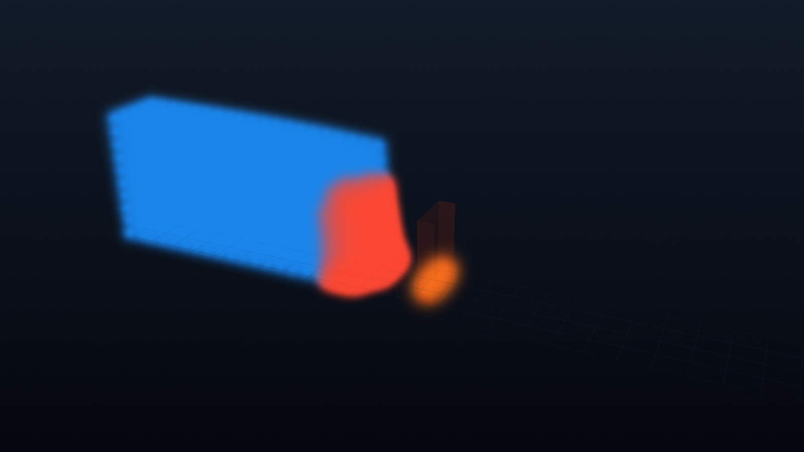

# Review - Trame Warp dam-break studio

## Outcome

The local Trame/VTK studio is ready to run uniform or two-level adaptive
dam-break cases on beast02. It exposes run-defining controls, a responsive dark
UI, a camera-preserving particle view, pause/resume/single-step/cancel, live
telemetry, scalar coloring, local/remote rendering, and buffered replay.

CUDA runs in a spawned process; only NumPy snapshots and metrics cross the
process boundary. The worker writes the final NPZ and a JSON manifest with
configuration, adaptation history, metrics, and GPU/Warp metadata.

## Diff summary

- Added the Trame 3/Vuetify 3 application and custom responsive theme.
- Added a VTK scene with fluid, wall, obstacle, axes, ground plane, scalar bar,
  point-Gaussian particles, and camera-preserving updates.
- Added a spawn-safe GPU worker, bounded latest-frame result queue, pause/step/
  resume/cancel protocol, and 120-frame replay buffer.
- Added app-side run validation, adaptive controls/telemetry, uniform/adaptive
  solver selection, and NPZ/JSON persistence.
- Added pip-only requirements, launch documentation, unit tests, worker smoke,
  and result renderer.

## Boundary and dependencies

All app and experiment files live under the implementation memory boundary.
No generic PySPH API/ABI, build/release configuration, or Spack package changed.
The venv received pip-only `trame`, `trame-vtk`, and `trame-vuetify`.

## Behavioral validation

```text
$ python -m pytest -q pysph/base/tests/test_warp_adaptive.py \
    .ai/implementations/blast-from-the-past/apps/warp_dam_break_studio/test_studio.py
19 passed in 0.93s

$ python -m py_compile pysph/base/warp_adaptive.py \
    .ai/implementations/blast-from-the-past/apps/warp_dam_break_studio/*.py
(exit 0)

$ python .ai/implementations/blast-from-the-past/apps/\
warp_dam_break_studio/worker_smoke.py
statuses: initializing, running, paused, paused, running, completed
frames: 5
paused_once=true, stepped_once=true, resumed_once=true
fluid=1630, coarse=910, fine=720, split_parents=90
mass_drift=0.0, all_finite=true
runtime.device_name=NVIDIA GeForce RTX 5090

$ curl http://127.0.0.1:12345/
HTTP/HTML response received from the Trame server
```

The smoke also re-read the worker-written JSON manifest and asserted the finite
result and exact RTX 5090 runtime metadata.

## validate-memory.py

```text
$ python .ai/implementations/blast-from-the-past/scripts/validate-memory.py
validate-memory: PASS

$ git diff --check
(exit 0)
```

## Boundary amendment

- `implementation.md` boundary section updated: n-a
- Amendments log entry: n-a

## Visual aid

```text
browser (Vuetify + vtk.js/remote VTK)
          | commands                    ^ snapshots + telemetry
          v                             |
Trame server ---- bounded queue ---- spawned CUDA worker
     |                                      |
VTK PolyData/ring replay          Warp adaptive simulation
                                             |
                                  final NPZ + JSON manifest
```

The rendered particle viewport is:


## Risks and incomplete work

- Automated Edge capture from Windows could fetch the WSL-hosted HTML but did
  not complete Trame's loopback WebSocket, so orbit/pan/zoom, responsive layout,
  and local/remote switching still need a user-side browser acceptance pass.
- VTK emits a benign headless `DISPLAY=:0` warning before selecting EGL in the
  non-browser renderer.
- Snapshot transport is intentionally lossy under browser backpressure; the
  solver is authoritative and the final NPZ remains complete.
- The app is local/single-user only and has no authentication or job scheduler.
- A dedicated viewport screenshot-download button was not added; final result
  data and the offline VTK renderer are available.

## Unresolved questions

- After hands-on use, should the default run be extended from 250 to 500 steps
  so the wave reaches the obstacle despite the fine-level global timestep?
- Should a later app checkpoint add WebSocket compression or server-side
  decimation for substantially larger particle counts?

## Sign-off

- Review mode: prototype-owner
- Prototype owner: @kunalpuri-prediqt
- Prototype authorization, verbatim quote:
  > ok. my VM is at gcloud compute ssh gcp-prediqt-rtx6000x1     --zone=us-central1-b
  > -- commit and push here -- go tot the VM and fire up the app so I can connect from the browser here
  > - 2026-07-31T14:41:36 CEST

Prototype-owner authorization permits only a local `prototype:` commit.
Cumulative exact `@prabhu: LGTM` remains required before upstream promotion.
