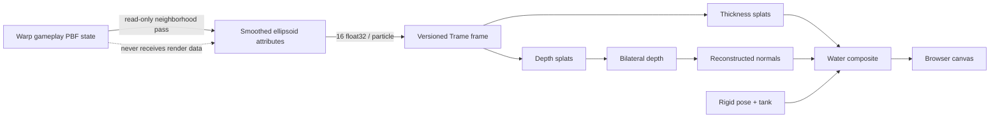

# Review - gameplay WebGPU fluid surface renderer

## Outcome

Gameplay now defaults to a continuous client WebGPU `Fluid surface` while
retaining the prior `Particles` view as its explicit VTK fallback. Adaptive
and Uniform remain unchanged server-rendered scientific particle views.

The gameplay solver computes display-only smoothed centers and bounded
anisotropic ellipsoid frames on Warp. A versioned 64-byte-per-particle frame
crosses Trame state; the browser performs analytic ellipsoid depth and
thickness splats, bilateral depth smoothing, normal reconstruction, and a
water composite with Fresnel reflection, refraction, Beer--Lambert absorption,
procedural tank context, and the moving quaternion box. None of the display
attributes feed back into PBF state.

The hardware browser gate passes comfortably: WebGPU completion measured
`3.30/5.80 ms` median/p95 at a 1280x720 Edge viewport. Hands-on tuning then
made the material less capsule-like and added a bounded 7,020-particle Rich
preset for a materially smoother local view. This is a visual prototype, not
scientific free-surface or ray-tracing evidence.

## Diff summary

- `pysph/base/warp_game.py` adds persistent display-center/covariance/axes/
  scale arrays, Warp neighborhood covariance and eigensolve kernels, strict
  anisotropy/fallback bounds, snapshot fields, and render-preparation timing.
- `pysph/base/tests/test_warp_game.py` adds non-mutation, finite,
  orthonormal/right-handed, bounded-scale, and deterministic sparse-fallback
  oracles.
- `surface_transport.py` adds the validated version-1 16-float particle layout
  and exact diagnostic decoder; `test_surface_transport.py` covers exact
  round-trip, replay identity, malformed payload rejection, non-finite data,
  and the 96 KiB wire gate.
- `assets/webgpu_surface.js` is a self-contained raw-WebGPU ES module with no
  CDN/npm/runtime dependency. It owns feature/device/shader validation,
  resize/camera lifecycle, four render pipelines, debug targets, rigid-box
  shading, timings, and fallback reports.
- `app.py`, `studio.css`, and studio tests add surface/particle routing,
  optical/debug controls, explicit approximation labeling, automatic failure
  fallback, replay/mode switching, transport/browser telemetry, and the Trame
  3.12 state-watcher workaround.
- `test_webgpu_surface.mjs` covers decoder, malformed length/header, camera
  inversion, canvas sizing, capability fallback, and shader entry contracts.
- README, ADR-0013, references, experiment, aspect memory, session/daily/current
  pointers, and this review document design and evidence.
- No dependency/build/release configuration, generic API/ABI, Adaptive/
  Uniform solver, generated scientific equation source, or NNPS implementation
  changed.

## Behavioral and numerical changes

- Gameplay snapshots now include `render_xyz`, `render_axes`, `render_scale`,
  and `render_neighbors`. They remain display-only and are saved/restored as
  optional arrays alongside the established schema.
- A covariance neighborhood has a configurable minimum count. Sparse or
  degenerate particles deterministically use identity axes and isotropic
  radius. Dense axes are orthonormal/right-handed; scale ratios are clamped
  and positive.
- Each browser particle is exactly four `vec4<f32>` records: center/speed plus
  three scaled basis columns; one spare component carries neighbor count.
- Gameplay + Surface skips `ParticleScene.update`, VTK rendering, and JPEG
  generation per displayed frame. Particle mode and both scientific profiles
  retain the old path. Replay repacks the selected retained snapshot.
- WebGPU shader compilation errors, missing adapters, or initialization errors
  return a visible failure and automatically set `gameplay_view=particles`.
- Pressure remains unavailable in gameplay; surface shading is not a pressure
  substitute. The scientific pressure/speed/refinement controls remain on VTK.

## Visual/data flow



## Hardware-browser evidence

Edge 151 headless hardware session, WebGPU `vendor=nvidia`,
`architecture=blackwell`, non-fallback adapter. Browser viewport `1280x720`,
canvas `1265x656`, 1,000 fluid particles. A completed 23-frame buffer was
replayed twice after warm-up.

| Measurement | Result | Gate |
|---|---:|---:|
| Packed frame | `85,336 B` | `<=98,304 B` pass |
| Server pack median / p95 | `0.182 / 0.224 ms` | median `<=2 ms` pass |
| Browser upload median / p95 | `0.000 / 0.100 ms` | separated/report |
| WebGPU completion median / p95 | `3.300 / 5.800 ms` | `<=16.7 / <=33.3 ms` pass |
| Dropped / stale | `0 / 0` | pass |

The run completed all 250 requested gameplay steps. Captures inspected the
continuous early impact, settled pool, orange floating box, raw depth,
accumulated thickness, and reconstructed normals. Orbit, wheel zoom, reset,
resize, timeline replay, and Surface -> Particles -> Surface passed. Particle
mode immediately restored a retained VTK/JPEG frame; returning to Surface
republished the selected replay step.

Primary evidence is recorded in experiment
`2026-08-05_warp-webgpu-fluid-surface`; temporary browser captures are not
added to the repository.

A second hands-on run exercised the Rich `dx=0.05` preset with 7,020 fluid
particles. It completed 250 steps with WebGPU completion near `4.0 ms`, server
pack median `0.580 ms`, and a `599,040 B` packed frame. The earlier depth
reconstruction had visibly preserved particle lobes; the corrected composite
uses gentler depth blending, a wider normal footprint, thickness-contoured
silhouettes, wavelength-dependent absorption, restrained Fresnel/specular,
tank context, and simulation-time micro ripples. The result is substantially
more continuous at early impact, though Fast remains visibly resolution
limited. Rich intentionally does not satisfy the 96-KiB Fast transport gate.

## Raw validation output

```text
$ node test_webgpu_surface.mjs
1..6
# tests 6
# pass 6
# fail 0

$ pytest -q test_surface_transport.py test_studio.py
..................................                                       [100%]
34 passed

$ pytest -q pysph/base/tests/test_warp_game.py \
    pysph/base/tests/test_warp_adaptive.py \
    pysph/base/tests/test_warp_codegen.py \
    pysph/base/tests/test_warp_nnps.py
........................................................................ [ 91%]
.......                                                                  [100%]
79 passed, 2 warnings in 33.79s

$ python -m py_compile app.py surface_transport.py
[no output]

$ node --check assets/webgpu_surface.js
[no output]

$ python scripts/update-decision-graph.py
Generated decisions/index.json and decisions/graph.md

$ git diff --check
[no output]

$ python scripts/validate-memory.py
validate-memory: PASS
```

The two warnings are installed Warp ctypes layout deprecations for future
Python 3.19 behavior, not failures in this change. A first sandboxed host-test
attempt could not see the NVIDIA driver; the recorded 78-pass result is the
required RTX-enabled rerun.

The editor browser subsequently exposed a stricter WGSL portability failure:
compound assignment to a writable vector swizzle was rejected by its D3D
backend. The vertex shader now computes the offset separately and assigns the
complete `vec4`. A Node source-contract test rejects future compound
assignments to multi-component swizzles. A fresh Edge run on the default
backend completed the 250-step gameplay profile and reported WebGPU `READY`
with no shader error or particle fallback.

## Risks and unresolved questions

- Base64 adds a 4/3 wire expansion and host/browser copies. At 1,000 particles
  it passes, but larger remote profiles may need binary websocket transport.
- The 7,020-particle Rich preset confirms that risk at `599,040 B` per frame;
  it is a local quality preset until binary transport/display decimation is
  implemented.
- Screen-space refraction is view-dependent and cannot sample offscreen scene
  information. The reconstructed normal target shows high-frequency splat
  detail; more tuning may improve cinematic quality without changing physics.
- `GPUQueue.onSubmittedWorkDone` measures local submitted GPU completion. It
  does not include display scan-out, human input latency, or remote-network
  transport.
- True foam, spray, bubbles, vorticity confinement, surface tension, mesh
  extraction, ray tracing, and OptiX remain out of scope.
- The actual no-WebGPU branch is covered by deterministic JS/Python fallback
  tests; hands-on acceptance used a capable adapter.
- This surface must not be used as pressure, energy, hydrostatic, APR, or
  world-space free-surface validation evidence.

## Promotion state

Prototype-owner commit/push authorization is recorded verbatim below. This
does not authorize upstream promotion; exact `@prabhu: LGTM` remains required
before production/PR promotion.

## Owner verdict

Prototype-owner authorization by @kunalpuri-prediqt at
2026-08-06T17:04:31 CEST, verbatim:

> ok. commit and push

This authorizes the cumulative prototype commit and push to the owner's fork;
it is not upstream promotion approval.
